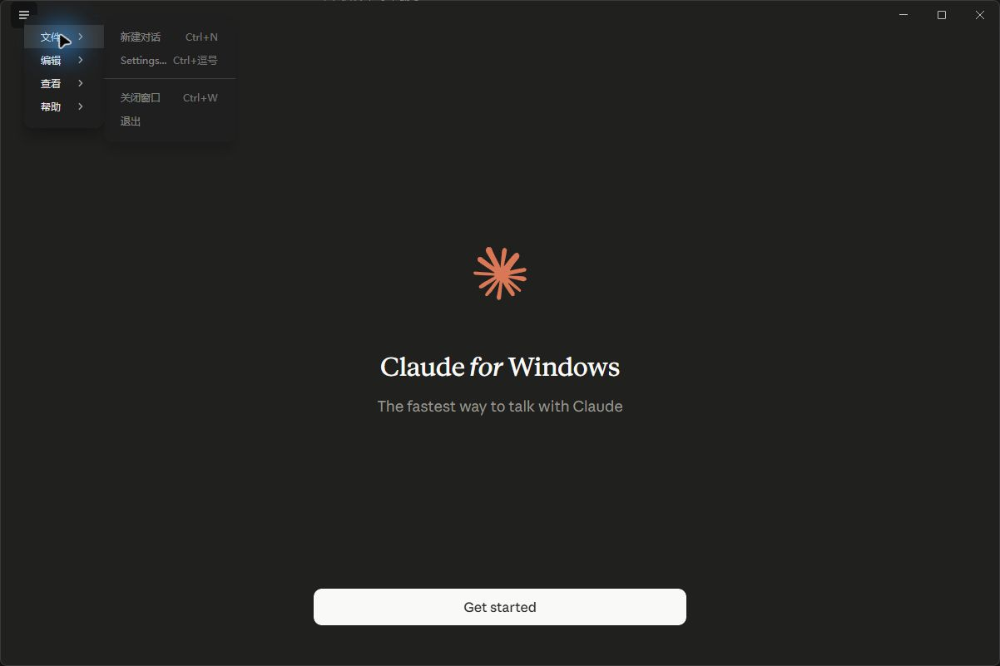

# claude-zh-bilingual

让 Claude 说中文，但留住英文。

| 其他汉化包 | claude-zh-bilingual |
|---|---|
| 按 Shift+Tab 切换模式 | 按 Shift+Tab 切换模式 |
| 压缩上下文 | 压缩上下文 (compact) |
| 权限被拒绝 | 权限被拒绝 (Permission denied) |

**看得懂中文，还能拿英文原文去查官方文档和搜报错。**

Claude Code / Claude Desktop 中文化 · 中英术语对照模式 · Claude 汉化 zh-CN localization with bilingual terminology

> v0.1.0 支持 Windows 非 MSIX Claude Desktop `1.18286.0`，D1–D4 已全部通过。当前源码另含 Claude Code `2.1.201` 的 A 层适配，S1–S3 已全部通过。



## 当前能力

- `zh`：仅把人工确认的 SAFE 界面文案替换为中文。
- `bilingual`：中文后按术语优先级保留最多两个可检索英文词。
- Claude Code A 层：中文 statusline、启动提示、回复样式和 `/zh-*` skills，不修改 Claude Code 程序。
- 安装前在应用目录之外创建并校验逐文件备份。
- 安装中途失败自动还原；手动还原后逐文件验证原始 SHA-256。
- 检测到正在运行的 Claude 时拒绝修改，不会结束进程。
- Microsoft Store / 企业 MSIX 只读检测并拒绝写入。
- 每 6 小时检查官方版本源；结构稳定时自动继承并开 review PR，低于 80% 继承率时停止并开 issue。

补丁只处理外部语言资源与 SAFE UI 字面量。`app.asar` 仅用于读取版本，不会被重打包；鉴权、登录、凭证、计费、限额和代理路径不在修改范围内。

## 安装

从 GitHub Release 下载 `claude-zh-0.1.0.tgz`，在空目录执行：

```powershell
npm install .\claude-zh-0.1.0.tgz
npx claude-zh status
npx claude-zh install desktop --mode=zh
```

双语模式：

```powershell
npx claude-zh install desktop --mode=bilingual
```

安装前先正常退出 Claude。补丁器会打印备份目录；如果发现 MSIX、版本不匹配、Claude 仍在运行或资源结构不匹配，会在写入前停止。

### Claude Code A 层（当前源码）

```powershell
npm ci --ignore-scripts
node .\bin\claude-zh.cjs status code
node .\bin\claude-zh.cjs install code --layer=a --mode=zh
claude
node .\bin\claude-zh.cjs restore code
```

双语模式把安装命令改为 `--mode=bilingual`。安装器只合并缺失设置；已有 statusline、output style、hooks 和同名文件不会被覆盖。当前 Claude Code `2.1.201` 不注册中文命令名，因此提供 `/zh-compact`、`/zh-help`、`/zh-resume`，不声称 `/压缩` 已受支持。

## 状态与还原

```powershell
npx claude-zh status
npx claude-zh restore desktop
```

还原前同样先退出 Claude。还原成功后，生成的 `zh-CN.json`、状态文件和已使用的备份会被清理。

完整平台状态见 [`docs/support-matrix.md`](docs/support-matrix.md)，Desktop 实测记录见 [`docs/W3-4-总结.md`](docs/W3-4-总结.md)，CLI A 层证据见 [`docs/extension-points.md`](docs/extension-points.md) 和 [`docs/W5-6-总结.md`](docs/W5-6-总结.md)，自动化演练与当前原生版本阻塞见 [`docs/W7-8-总结.md`](docs/W7-8-总结.md)。

## 从源码验证

需要 Python 3.11+ 与 Node.js 22.12+。依赖只安装到项目环境，不需要全局安装 Claude，也不会修改本机 MSIX：

```powershell
python -m pip install '.[dev]'
npm ci --ignore-scripts
python -m unittest discover -s tests -v
python schema/validate.py corpus
npm test
npm run validate:support
npm pack --dry-run
```

## 项目定位

本项目不是全局字符串替换。核心资产是可跨版本继承的翻译语料、中英术语表、经过验证的 SAFE 风险白名单，以及提取、分类、校验和冒烟测试流水线。

只有明确标记为 `SAFE` 的界面展示文案才允许翻译。tool description、system prompt、代码匹配字符串以及无法确认用途的内容均保持英文。

M1 实测数据见 [`report/M1-勘测报告.md`](report/M1-勘测报告.md)。

## 安全边界

- 不修改鉴权、登录、凭证、计费、用量、限额或代理配置。
- 补丁脚本不发起网络请求。
- 不收集遥测或用户数据。
- 修改前必须备份，失败时自动还原。
- 仓库和 release 不分发 Claude 原程序、二进制、ASAR 或打好补丁的成品。

本项目是非官方项目，与 Anthropic 无关。Claude 是 Anthropic, PBC 的商标。官方安装入口见 [Claude 下载页](https://claude.com/download)。

## License

- 代码：MIT，见 [`LICENSE`](LICENSE)
- `corpus/` 翻译语料：CC0-1.0，见 [`corpus/LICENSE`](corpus/LICENSE)
